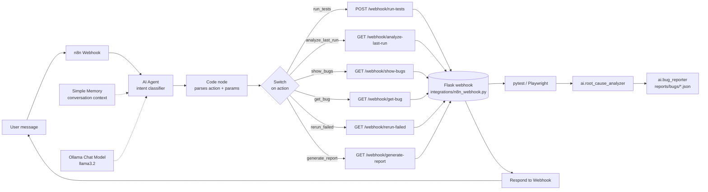
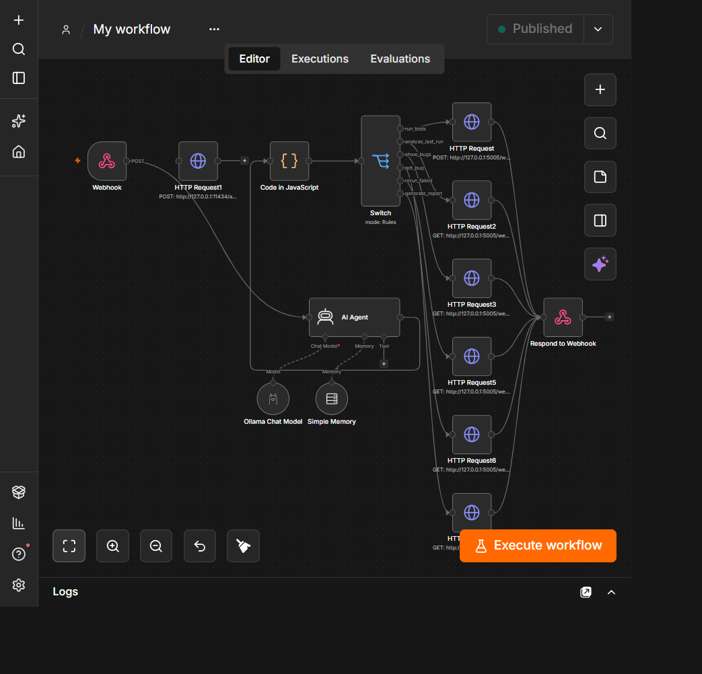

# Playwright Automation Framework

A modular, multi-layer test automation framework built on **Playwright** (UI), **requests** (API),
and **SQLite/DB-API** (database), orchestrated with **pytest** and reported via **Allure**.

## Folder structure & purpose

```
playwright_framework/
│
├── core/                     # Playwright engine plumbing + Page Object base class
│   ├── browser_manager.py    # Launches/closes the Playwright browser (chromium/firefox/webkit)
│   ├── base_page.py          # BasePage: click/fill/navigate helpers all page objects inherit
│   ├── context_manager.py    # Creates/closes isolated BrowserContext per test (viewport, base_url)
│   └── locator_healer.py     # Self-healing/self-learning locator resolution (Phase 2 & 4)
│
├── ai/                       # AI features (Phases 3-5), powered by a local Ollama server
│   ├── ollama_client.py      # Thin client for the local Ollama REST API
│   ├── root_cause_analyzer.py# Classifies test failures (app_bug/locator_issue/env/flaky) via the LLM
│   ├── bug_reporter.py       # Auto-files a local bug report JSON (with a persisted status field:
│   │                         # open/resolved/still_failing) for confident app_bug failures
│   ├── test_generator.py     # Generates a draft pytest test from a plain-English user story
│   ├── nlp_executor.py       # Executes a plain-English instruction via a fixed action vocabulary
│   └── assistant.py          # Conversational CLI tying all of the above together (`python -m ai.assistant`)
│
├── config/                   # Environment-aware configuration
│   ├── config_reader.py      # Merges config.yaml + environments/<ENV>.yaml + .env/OS vars
│   ├── config.yaml           # Default settings (browser, timeouts, base_url, etc.)
│   └── environments/
│       ├── qa.yaml           # QA overrides
│       └── uat.yaml          # UAT overrides
│
├── pages/                    # Page Object Model classes (one file per screen), see pages/README.md
│
├── api/                      # API testing layer
│   ├── api_client.py         # requests.Session wrapper: get/post/put/patch/delete + logging
│   ├── api_request.py        # Fluent builder for reusable request definitions
│   └── api_response.py       # Wraps a Response with assert_status/json_path helpers
│
├── database/                 # DB validation layer
│   ├── db_connection.py      # Opens/closes a DB-API connection (SQLite by default)
│   └── db_helper.py          # execute/fetch_one/fetch_all query helpers
│
├── utils/                    # Cross-cutting helpers
│   ├── logger.py             # Console + rotating file logger factory
│   ├── waits.py              # Explicit waits + smart_wait() dynamic wait engine (Phase 2)
│   ├── retry.py              # smart_retry() decorator for transient-only retries (Phase 2)
│   ├── screenshot_manager.py # Captures screenshots into reports/screenshots
│   ├── trace_manager.py      # Starts/stops Playwright tracing into reports/traces
│   └── data_reader.py        # Reads JSON/CSV fixtures from test_data/
│
├── tests/                    # Test suites
│   ├── framework/            # Sanity tests validating the framework itself
│   ├── ui/                   # UI tests (use the `page` fixture + pages/)
│   ├── api/                  # API tests (use APIClient)
│   ├── db/                   # DB tests (use DBHelper)
│   └── integrations/         # Flask-test-client unit/API tests for integrations/n8n_webhook.py
│
├── integrations/             # External orchestration
│   └── n8n_webhook.py        # Flask server: run-tests/analyze/show-bugs/get-bug/rerun/generate-report
│
├── test_data/                # JSON/CSV test data fixtures
│
├── docs/                     # Architecture diagrams / screenshots referenced from this README
│
├── reports/                  # Test run artifacts
│   ├── screenshots/          # Failure screenshots
│   ├── traces/               # Playwright trace .zip files
│   ├── bugs/                 # Auto-filed bug reports (JSON, gitignored)
│   └── allure-results/       # Raw Allure results consumed by `allure serve`/`allure generate`
│
├── conftest.py                # Shared pytest fixtures: browser_manager, context, page + auto screenshot-on-fail
├── pytest.ini                 # pytest markers, testpaths, Allure results dir, logging
├── requirements.txt           # Pinned Python dependencies (exact versions, see `pip freeze`)
├── .env                       # Local environment overrides (ENV, BASE_URL, HEADLESS, ...)
├── .gitignore                 # Excludes venvs, caches, generated reports, secrets
├── Jenkinsfile                # CI pipeline: install deps, install browsers, run tests, publish Allure report
└── README.md                  # This file
```

## Setup

```powershell
python -m venv .venv
.venv\Scripts\pip install -r requirements.txt
.venv\Scripts\python -m playwright install
```

## Configuration

Set the target environment via `.env` or an OS environment variable:

```
ENV=qa            # loads config/environments/qa.yaml on top of config/config.yaml
BASE_URL=...
HEADLESS=true
```

`ConfigReader.get("key")` is used everywhere in the framework to read merged config values.

## Running tests

```powershell
# All tests
.venv\Scripts\python -m pytest

# Only UI smoke tests
.venv\Scripts\python -m pytest -m "ui and smoke"

# Generate/view the Allure report after a run
allure serve reports/allure-results
```

## Writing new tests

- **UI**: add a Page Object under `pages/` (extends `core.base_page.BasePage`), then a test under
  `tests/ui/` that uses the `page` fixture from `conftest.py`.
- **API**: instantiate `api.api_client.APIClient` in a test under `tests/api/` and assert with
  `APIResponse.assert_status(...)` / `assert_json_contains(...)`.
- **DB**: use `database.db_helper.DBHelper` in a test under `tests/db/` to run queries and assert
  on the returned rows.

## AI features (Phases 2-5, powered by a local Ollama server)

Install [Ollama](https://ollama.com) and pull a model once: `ollama pull llama3.2`. The server
must be running locally (`http://localhost:11434` by default) for anything below to work.

- **Self-healing locators / self-learning repository** (`core/locator_healer.py`): call
  `page_object.smart_click(key, [candidate_selectors])` / `smart_fill(...)` instead of `click`/`fill`
  to resolve elements via a ranked list of selectors, persisted and re-scored in
  `test_data/locator_repository.json` on every run.
- **Dynamic wait engine** (`utils/waits.py`): `smart_wait(page, condition_fn, timeout)` polls an
  app-specific readiness condition instead of a fixed sleep.
- **Smart retry** (`utils/retry.py`): `@smart_retry(max_attempts=3)` retries only transient
  Playwright/network exceptions - it never masks a real assertion failure.
- **Root cause analysis + auto bug creation** (`ai/root_cause_analyzer.py`, `ai/bug_reporter.py`):
  set `ai_enabled: true` in `config.yaml` (or `AI_ENABLED=true`) and failing tests are automatically
  classified and, if confidently an `app_bug`, filed as a JSON report under `reports/bugs/`.
- **Test generation from stories** (`ai/test_generator.py`): `generate_test(story, file_name)` drafts
  a pytest test under `tests/ui/generated/` in this repo's existing style - always review before
  trusting it.
- **NLP-based execution** (`ai/nlp_executor.py`): `execute_instruction(page, "plain English step")`
  maps the instruction to a fixed, auditable action vocabulary (login, add_to_cart, checkout, ...)
  rather than generating/running arbitrary code.
- **AI Automation Assistant** (`ai/assistant.py`): a conversational CLI wiring all of the above
  together. Run it with:
  ```powershell
  .venv\Scripts\python -m ai.assistant
  ```
  Commands: `generate <story>`, `nlp <instruction>`, `analyze <test_name> | <exception>`,
  `run <pytest args>`, `help`, `exit`.

## n8n integration

`integrations/n8n_webhook.py` runs a Flask server exposing 6 endpoints that an n8n workflow (or any
HTTP client) uses to drive the whole "AI QA agent" loop remotely: run tests, analyze the last
failure, list/inspect bugs, rerun exactly the tests that failed, and generate a report - all
triggered from a single natural-language request.

### Architecture



The Webhook receives the user's natural-language request; an **AI Agent** node (n8n's LangChain
agent) does the actual intent classification, backed by a local **Ollama Chat Model** (`llama3.2`)
and a **Simple Memory** node that gives it conversational context (e.g. "run them again" or "why did
they fail" correctly resolve using the previous turn, without the caller repeating themselves). The
Code node then validates/normalizes whatever JSON the agent produced before the Switch routes it to
one of the 6 Flask endpoints below. Test execution itself still goes through the Python/Flask bridge
- only the classification layer runs through n8n's native AI nodes now.

n8n workflow canvas (published):



### Running the webhook server

```powershell
$env:N8N_WEBHOOK_SECRET = "choose-a-strong-secret"   # required - server refuses to start without it
.venv\Scripts\python.exe -m integrations.n8n_webhook
```

Every request (except `GET /health`) must include a `X-Webhook-Secret` header matching
`N8N_WEBHOOK_SECRET`, or it's rejected with `401`. The server always forces `AI_ENABLED=true` for
the pytest subprocess it launches, regardless of `config.yaml`'s `ai_enabled` setting - the
normal/local pytest workflow can keep AI off by default, while anything triggered through n8n always
gets RCA + auto bug-filing:

```
Normal pytest run   -> ai_enabled: false (config.yaml)  -> AI optional
n8n-triggered run    -> AI_ENABLED=true (forced by n8n_webhook.py) -> AI always on
```

### Endpoints

| Endpoint | Method | Purpose |
|---|---|---|
| `/health` | GET | Uptime check, no auth required |
| `/webhook/run-tests` | POST | Runs `path`/`markers` via pytest; persists `reports/last_run.json` |
| `/webhook/analyze-last-run` | GET/POST | Root-cause summary of the last run, no re-run |
| `/webhook/show-bugs` | GET/POST | Lists filed bugs, optional `severity` filter |
| `/webhook/get-bug` | GET/POST | Full details for one `bug_id` |
| `/webhook/rerun-failed` | GET/POST | Reruns only the tests that failed last time (or one bug's test via `bug_id`); updates that bug's persisted `status` to `resolved`/`still_failing` |
| `/webhook/generate-report` | GET/POST | Combines the last run + last rerun + live bug status into a human-readable report |

`path` must resolve inside `tests/`, `markers` is a pytest `-m` expression, `callback_url` (optional,
`run-tests` only) receives the JSON result via POST, and `async: true` returns immediately (202) and
posts the result to `callback_url` once the run finishes - use this for long test suites so n8n's
HTTP node doesn't time out waiting.

### Bug lifecycle

Every auto-filed bug (`reports/bugs/BUG-*.json`) carries a persisted `status` field that
transitions through real state changes, not just a value computed at report time:

```
open --(rerun-failed, test now passes)--> resolved
open --(rerun-failed, test still fails)--> still_failing
```

### Testing the webhook itself

`tests/integrations/test_n8n_webhook.py` covers all 6 routes plus the validation helpers using
Flask's test client with `subprocess.run` mocked out (no real pytest/Ollama/browser is launched):

```powershell
.venv\Scripts\python -m pytest tests/integrations -v
```

## Reporting

- Screenshots are captured automatically on test failure (see the `pytest_runtest_makereport` hook
  in `conftest.py`) and saved to `reports/screenshots/`.
- Playwright traces are recorded for every test and saved to `reports/traces/`.
- Allure results are written to `reports/allure-results/` on every run (`pytest.ini` sets
  `--alluredir` by default).

## CI/CD

The `Jenkinsfile` defines a declarative pipeline that checks out the repo, creates a virtualenv,
installs dependencies and Playwright browsers, runs the pytest suite, and publishes the Allure
report as a build artifact.
